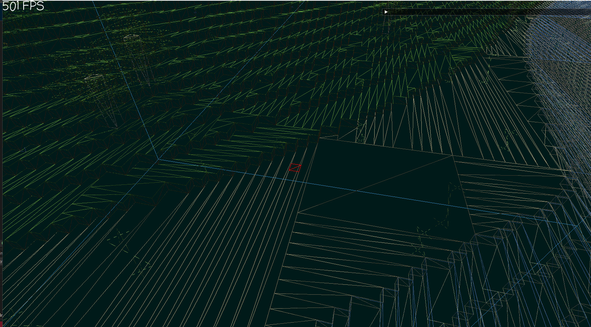

# GameEngine2D

## Opis

Projekt silnika voxelowego stworzony z użyciem biblioteki GLEW. Praca skupia się na generowaniu różnorodnych terenów oraz optymalizacji renderowania w celu poprawy wydajności.

## Generator

W grze znalazł się generator terenu wykorzystujący kilka technik, takich jak Perlin noise oraz Wave Collapse Function.

## Optymalizacja

W projekcie zostało użytych kilka sposobów optymalizacji. Jednym z nich jest greedy meshing, polegający na redukcji liczby przesyłanych wierzchołków do karty graficznej, a także redukcji liczby trójkątów poprzez usunięcie przesłoniętych ścian oraz redukcję danych przesyłanych do GPU.

